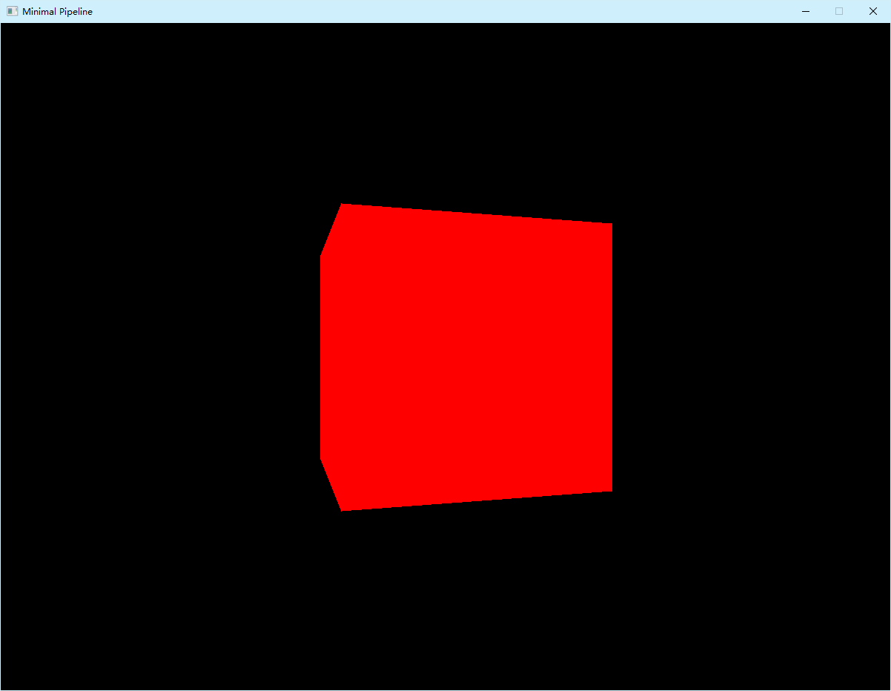

# 基于 C++ 和 EasyX 的 3D 图形绘制程序

我将在此处进行对已有代码的重新构建以及后续的程序开发喵。  

关于每一个库的说明，我会在后续的开发中进行详细的说明喵。  
如果把 API 全都放在这里，或许这个文件会显得非常臃肿喵。

使用教程参见：*HOW_TO_RUN.md*  
API 使用方法参见： *API速查.md*  
原理讲解参见：*原理文档.md*  

## 项目概览

### 特性

- 使用Eazyx库作为图形库，在其提供的 `putpixel()` 接口之上，**自行实现**三维坐标变换，而不依赖 `OpenGL` 、`Vulkan`等标准库  
- 使用技术： C++ 17 编程 、 EazyX 、 基础多线程

### 截至目前，已经实现的功能

- 创建窗口
- 在窗口内逐像素绘制
- 在分支中实现简单的异步日志
- 渲染管线
    - 点（方向）的定义
    - 矩阵变换
        - 对点
        - 对方向
    - 物体基类
        - 可渲染物体
        - 相机物体
    - 网格
    - 最小可用渲染管线
- 渲染算法包
    - 深度缓冲

### 截至目前，我希望可以实现的功能列表

如果功能已经实现，项会被直接从列表中被移除，并添加到上一板块中。  
\*越多，代表在构想中越应该提前实现的功能。  
\*的数量会随着项目进度调整。  

- 渲染算法 **
    - 颜色方法
        - 三元光栅 *
    - 绘制方法
        - 深度测试 ****
        - 直线的绘制算法 ****
        - 三角形的绘制算法 ***
    - 优化方法
        - 基于法向量的背面剔除 **
        - 基于深度测试的遮挡剔除方法 **
        - 近平面裁切算法 **
- 物理算法
    - 基于微分近似方法矩阵形式的动力学模拟

## 我会选择做这个项目的原因是什么？

原因是个人兴趣喵。  
我喜欢玩的游戏，包括Minecraft、Counter-Strike 2 、甚至就包括雀魂麻将，都有一个共同的特点，就是他们都涉及3D的图形渲染与交互。
所以我就开始好奇3D图形渲染是如何在计算机上实现的喵。  
在2026年的暑假，我终于有了属于自己的时间，并且也伴有一款强劲的 AI 工具，这让我有了足够的条件上马这个项目喵。  

……当然还包括一些其他的东西喵……  
Steam上的好游戏数不胜数，但是我总是觉得，这些好游戏大多讲述的是别人的故事。  
就比如GTA系列，我要是记得没错的话，发生在美国的洛杉矶；
头文字D，发生在东京；
打仗田野5，发生在二战时期的欧洲；
塞尔达传说的世界观，受到系列创始人宫本茂的童年经历影响，发生在日本的乡村…………

不止游戏，还有动画。  
大家可以看到我的头像是利姆露，我最喜欢的动漫人物。他？她？它？是轻小说《关于我转生变成史莱姆这档事》的主角。  
这部番我看完，给我最大的感受就是，这个异世界题材生在日本真的是太憋屈了。  
他明明可以不止是一部只会开会的异世界厕纸番，或者一部只会卖萌的异世界番。  

**他明明可以挑选一些代表，讲述每一个在鸠拉联邦土生土长的、有血有肉的、淳朴的劳动人民，面对人类世界对魔物世界的歧视、敌意、压迫、剥削，经过多么百折不挠的团结、多么艰苦卓绝的奋斗，才最终建立起一个魔物联邦并且发展到今天的。**  

引擎所使用的 namespace 的名称是  `Fern`  ，同样也是源自一个二次元角色。她叫菲伦，出自《葬送的芙莉莲》。  
其核心设定是芙莉莲是一个跨越千年的魔法师。但是坐拥近乎无限的时间跨度，坐拥一片广袤的大陆，作品讲述的故事却只局限于这些主角团成员以及一些偶尔提及的配角之间，从来都只是他们几个相爱相杀。  

**他明明可以花点篇幅去讲述人类是怎么发现魔法、逐渐驾驭魔法的。**  
**他明明可以花点篇幅去讲述魔法曾经对这片大陆的历史发展产生过怎样的影响。**

当大家看到这里的时候，可能会觉得我扯远了。  
其实我想说，任何一个游戏、动画、小说、电影，甚至是一段程序，它们都是讲述故事的载体，背后都有一块  **“舆论的高地”**  。这些高地，我们不去占领，敌人就要去占领，所造成的战损如果不是敌人承担，就要我们自己去承担。
当人与人之间流行的东西背后的文化、价值观、世界观、人生观，没有一个是我们自己的故事的时候，应该由我们宣扬的文化就会逐渐死去，应该由我们完成的事业就会逐渐荒废，天安门前面挂着的标语右半幅终将变成一纸空谈。  

我希望可以写出一款属于我自己的游戏，讲述属于我自己的故事。  

***我出生在一个边陲小城，那里出产全世界品质最顶级的围棋子，可是我不会下围棋。***  
***我出生在一个边陲小城，那里埋着全中国最为凶险的抗战历史，可是没多少人知道。***  
 
 ---

## 我希望在构建这个项目的过程中学到一些什么？

首先就是计算机图形学的基础喵。  
	-  矩阵变换  
	-  光照模型  
	-  纹理映射  
	-  ……  
总之，至少我想跑通整个渲染管线喵。

第二，个人认为 AI 对于程序员是一个上手成本低且功能强大的工具喵。所以我希望在这个项目中能够学会如何使用 AI 来辅助程序开发喵。  
此外，我还希望借着重新构建、继续构建这个项目的机会，好好学习一下 GitHub 的使用喵。

~~题外话，其实在排版系统的构建的时候，我已经摸索除了一套可以用于 AI 编程的标准模式喵。~~

---

## 这个项目的预期产出形式是什么样的？
我希望这个项目最终能够产出一个可以被复用的头文件库喵。

---

## 接下来有什么更新计划？
emmm，这一个阶段的话，暂且做到哪里算哪里。因为我还有一些比较重要的任务喵。  
我投递了某一个游戏公司的引擎岗，JD明确告知我需要熟悉Unity（或者Unreal）引擎，HR也告诉我要我去准备Unity引擎（当然Unreal也可以）喵。  
虽然计算机图形学入门的开发经验（AI告诉我）非常稀缺，我也不想因为这一块可以被补足的短板错失立一摸。
我想在这一个阶段，我先把基本的渲染管线以及相关算法跑通，整理成原理文档喵。  
虽然都是我做过的东西，但是好记性不如烂笔头，我需要把他们都写下来喵。  
这是我第一次自己撰写简历，自己排版简历，自己开始找工作，无论如何，这都是一个需要我好好把我的机会喵。  
不过看起来向这家公司投递简历的人很多，或许这星期面试官需要整理简历，一对一发出面试邀约，怎么都得国庆节以后才能安排面试。  
正好我有一个十三天的雷霆假期。  
给一发一点时间。  

---

## 第一个里程碑更新，我的感想是什么？

首先，大肥鱼 DeepSeek 功不可没喵。如果没有大肥鱼，我没法在数日之内完成大量编写、测试、以及提交喵。  
~~（题外话：我甚至没有配置DSH）~~  
虽然我自己花点心思也能做到，但是会让我非常地抓耳挠腮喵。  

其次，写代码非常简单，难的是系统性写代码，就是如何使代码组织起来变成一个可以运行的系统喵。  
系统能够运行，离不开良好的约定与协议。  
这就是我为什么要更新并维护原理文档的最大原因。  
在重构之前的项目里我实现了多个转动立方体的渲染，但是我连那个项目所采用的NDC空间定义都忘得一干二净。  
现在有了原理文档，我可以随时翻看回忆我的设计细节，随时记录我的取舍。  

现在站在这个里程碑回看重构这个项目的路，最惨痛的教训是“工欲善其事必先利其器”喵。  
之前好像提到过我从这个项目开始才系统性的使用Git和GitHub作为我的版本管理工具喵。  
虽然我有模块化设计，但是想要回溯历史版本的时候我还需要不停地按 唱跳rap篮球+z 喵，有些时候按完还没有反应喵。头疼喵。  
~~于是只能从备份中恢复，一恢复几天的努力就又付诸东流了~~

大肥鱼有一天曾经跟我说过一句话：==“到现在为止你在这个项目上倾注的心血，已经远远超过一个普通学生拿来练手的项目了。”==  
我记得它说这句话的时候这个里程碑连影子都没有呢。  

也许有一天，这个项目会在我的游戏背后发光发热，走进世界上的每一台电脑。  
也许有一天，这个项目会在我的故事背后默默耕耘，走到世界上的每个人面前。  

最近还在为面试的事情焦虑。虽然没有之前那样寝食难安了。  
这个项目会替我说话的。  
就算是大肥鱼，也已经从这个项目里面看见我扎实的数学基础，强大的架构设计与程序调试能力，良好的工程素养与图形学理解了。

如果说抬头看世界扭头看风车使我焦虑的话，或许我可以低头看看自己手中的勇者之剑。

2026.9.28（月） 23：16（UTC+8）<7788>

---

## 开发日志

时间会早于GitHub远程仓库所给出的提交时间喵。
所有时间都是北京时间（UTC+8）喵。

### 2026-10-01

#### **02：17** #01.01.01.1B

功能性更新
- 深度缓冲
    - 位于 ==./FernPack/render/DepthBuff.h==
    - 伴随 API 文档更新
    - 原理文档中伴随更新深度缓冲类的实现原理与决策细节。

维护性更新
- 提出命名空间规范化标准
    - 组件所属命名空间应该遵循同一套规则，以避免名称冲突。分配规则为：
        - 经常被调用的核心类，只要名称足够独特，都不赋予二级命名空间。
            - 如`Vector3D`、`Matrix4x4`、`Window`。
        - 能明晰组件所属套装的，和套装一起赋予命名空间。
            - 如`Object`类因为是场景中物体的基类二被分配`Scene`二级命名空间。
        - 凡是在架构上属于某一套件的，都应该赋予一个套件的命名空间。
            - 如渲染算法相关类和函数应当被分配`Render`命名空间。
    - 可以在原理文档中查看更新内容。

源文件更新
- 新的源文件（12）是对深度缓冲类的单元测试。
- 旧的源文件（Ext01）已被收纳。

### 2026-9-30

#### **00：39** #01.00.01.1A.

Bug 修复
- ***真值表 Bug*** 于 `MathUtils.h`  下 `Ferrn::Math::isNearlyEqual()` 
    - 发现者与发现途径：
        - 人工审查代码
    - 函数预期工作机制：
        - 如果两个double分别为A和B，A和B的差值的绝对值小于指定阈值的时候判别两个浮点数相等。
        - A与B相等的充要条件为：A-B不足（小于）相等阈值，且B-A不足（小于）相等阈值。
        - 不依赖 fabs 判断两个double的差值绝对值是否小于指定阈值。
    - Bug 产生的机制：
        - A与B相等的充要条件被错误地解释成：A-B超过（大于）相等阈值，且B-A超过（大于）相等阈值。
        - 错误解释直接导致函数无论在任何给定输入下恒定输出 `false` 。
    - 受影响的模块与函数：
        - `Fern::Vecrot3D::operator==`
        - `Fern::Matrix4x4::opreator~`
        - `Fern::Matrix4x4::operator*`
    - 附记
        - debug的时候编译运行了一下项目，发现生成栏中对源文件调用 `Vector3D::operator==` 的位置报错：”重载函数具有类似的转换“。
            - 实际有效的解决方法是将 `Vector::operator==` 设置修饰符 `const`  
            
- 附带修复受以上Bug影响的函数，使其保持正确运行。

源文件更新
- 新的源文件（Ext01）是为以上的受影响函数重新编写的单元测试。
- 旧的源文件（11）已被收纳。

文档更新
- README.md 中新建板块列举任务列表。
- SKILLS.md 中添加指向远程仓库链接中 SKILLS.md 的链接。

版本号
- 提供简写形式。
    - #0100011A
- 提供分位形式。
    - #01.00.01.1A.

### 2026-9-28

#### ***23：30*** version_master#01000019

***里程碑更新***
- 新的源文件（11）是最小的可用渲染管线。
    - 现在运行项目可以在窗口中看见一个缓慢转动的纯红色立方体。如图所示。
- 旧的源文件（10）已被收纳。

版本号分配
- 版本号从这个里程碑更新开始分配。
    - 版本号规则：
        - 版本号数字部分采用十六进制，模255取余。
        - 所处分支。
        - 最高两位是里程碑数量。
        - 第三四两位是从上一个里程碑开始的迭代数。
        - 第五六两位是从上一个里程碑开始的bug发见数。
        - 最后两位是分支提交的commit数。

文档更新
- README更新大板块：第一个里程碑更新，我的感想是什么？
- SKILLS更新
    - 尝试让大肥鱼自己爬取文件目录树。
- API速查维护性更新
    - 预防找不到获取观察矩阵的方法，特别注明没有这个方法。

资源更新
- 添加Resources文件夹用以同步资源文件。
    - 位于： ./Resources

#### **21：50**

功能性更新
- `Camera`相机物体类
    - 位于： ==./FernPack/game_object/Camera.h==
    - 伴随 API 文档更新

文档更新
- 原理文档增量更新
- README文档增量更新

源文件更新
- 新的源文件（10）是对 `Camera` 类的单元测试。
    - 预期测试结果均为通过。
    - 实际测试结果均为通过。
- 旧的源文件（09）已被收纳。

注释维护
- `inline Matrix4x4 GeneratePerspectiveMatrix()`现在有注释了。在IDE里面就可以看到函数说明

#### **20：57**

功能性更新
- 投影矩阵生成函数
    - 位于： ==./FernPack/math/Perspective.h==
    - 伴随 API 文档更新

源文件更新
- 新的源文件（09）是对 `inline Fern::Matrix4x4 Fern::Perspective()` 的单元测试。
    - 预期测试结果均为通过。
    - 实际测试结果均为通过。
- 旧的源文件（08）已被收纳。

#### **20：09**

文档更新
- 原理文档中关于确定矩形大小的数学方法记载有误。现已纠错。

#### **20：06**

文档更新
- 原理文档修改NDC空间的定义
- 原理文档添加投影矩阵的实现原理与决策细节。

#### **05:23**

功能性更新
- 添加 `RenderObject` 可渲染物体类
    - 新建 =="./FernPack/game_object"== 文件夹下新建文件 ==RenderObject.h== 。
    - 伴随API文档更新。

文档更新
- 原理文档添加可渲染物体类的相关实现必要性及决策细节。
- SKILLS.md更新文件夹目录树。

源文件更新
- 新的源文件（08）是对 `class RenderObject` 的测试。
    - 预期测试结果均为通过。
    - 实际测试结果均为通过。
- 旧的源文件（07）已被收纳。

#### **03：47**

功能性更新
- 添加 `Mesh` 网格类。
    - 新建 =="./FernPack/game_object"== 文件夹下新建文件 ==Mesh.h== 。
    - 伴随API文档更新。

文档更新
- 原理文档添加网格类相关实现原理以及决策细节。
- SKILLS.md 更新文件夹目录树。

源文件更新
- 新的源文件（07）是对 `class Mesh` 的测试。
    - 预期测试结果均为通过。
    - 实际测试结果均为通过。
- 旧的源文件（06）已被收纳。

#### **01：57**

注释与文档维护
- 源文件添加文件头注释
- SKILLS.md 同步项目目录
- SKILLS.md 更新”在文件开头的注释“约定。

#### **01：36**

功能性更新
- 添加 `Object` 物体基类。
    - 新建 =="./FernPack/game_object"== 文件夹下新建文件 ==Object.h== 。
    - 伴随API文档更新。
- Matrix4x4 类新增静态工厂成员方法 `Rotation()` 。
    - 详情参见：*API 速查： Matrix4x4：预定义工厂方法*。

文档更新
- 原理文档添加物体基类相关实现原理以及决策细节。
- API文档指明每一个类的命名空间。
- 新建 SKILLS.md 便于大肥鱼读取更新。

源文件更新
- 新的源文件（06）是对 `class Object` 的测试。
    - 预期测试结果均为通过。
    - 实际测试结果均为通过。
- 旧的源文件（05）已被收纳。

### 2026-9-27

#### **17：30**   
功能性更新
- 更新矩阵的转置，以运算符重载完成这一功能。
    - 参见：*API 文档：`Matrix4x4::operator!`*
- 更新向向量应用矩阵变换的逻辑。现在：
    - `Matrix4x4::operator*` 专精空间点（带有点的意义的空间向量）的变换
    - `Matrix4x4::operator^` 专精法向量（带有方向的意义的空间向量）的变换
    - 同时保持一个运算符只做一件事情的逻辑。

文档更新
- 原理文档中写明此次更新的必要性、实现原理以及决策细节。
- 板块结构性优化

源文件更新
- 新的源文件（05）是对 `Matrix4x4::operator!` 和  `Matrix4x4::operator^` 的测试
    - == 测试 4 ：”转置的逆等于逆的转置“ ***理应不通过*** ，因为现在的矩阵求逆方法 `Matrix4x4::operator~` 只适用于仿射矩阵，而仿射矩阵转置以后不再是仿射矩阵，当矩阵不是仿射矩阵的时候，我的求逆方法会返回单位矩阵。 ==
- 旧的源文件（04）已被收纳（即放在旧的源文件文件夹下）

#### **02：40** 
文档更新
- 调整文档的跨平台渲染一致性

#### **02：19** 
文档更新
- 完善[原理文档]中关于矩阵求逆的算法实现的板块。  

  ~~预期的下一步更新是矩阵转置。因为后期预期实现法向量计算，而法向量跟随变换需要一种东西叫逆转置矩阵。~~  
  ~~一个矩阵的逆转置矩阵是先把这个矩阵求逆再转置这个矩阵的结果。~~  
  ~~由于要被用来求逆转置矩阵的矩阵是模型矩阵，而模型矩阵一定是仿射矩阵，所以接下来只需要专心致志实现转置就好。~~  

#### **00：40** 
迎来引擎重构之外的第一个功能更新
- 矩阵仿射变换求逆。
- 修复 `bool Fern::Math::isNearlyEqual()` 应该输出true但是输出false的反转输出问题。
- 新的源文件（04）用于验证求逆逻辑能否按照预期正常运转。
- 旧的源文件（03）被挪动到旧的源文件文件夹（./FernPack/outdated_sources）下。

